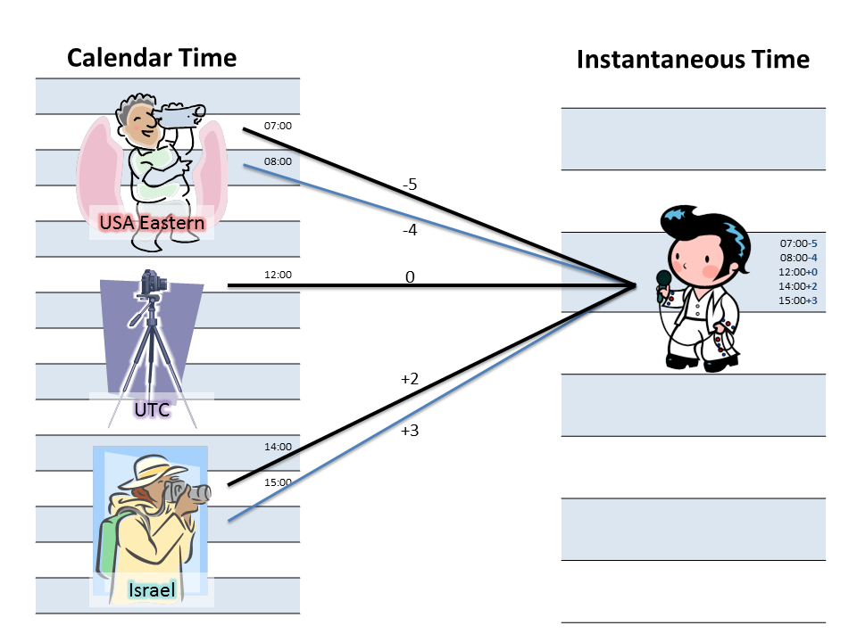

# DateTime VS DateTimeOffset in .NET

`DateTimeOffset` is a representation of *instantaneous time* (also known as *absolute time*). By that, I mean a moment in time that is universal for everyone (not accounting for [leap seconds](https://en.wikipedia.org/wiki/Leap_second), or the relativistic effects of [time dilation](https://en.wikipedia.org/wiki/Time_dilation)). Another way to represent instantaneous time is with a `DateTime` where `.Kind` is `DateTimeKind.Utc`.

This is distinct from *calendar time* (also known as *civil time*), which is a position on someone's calendar, and there are many different calendars all over the globe. We call these calendars *time zones*. Calendar time is represented by a `DateTime` where `.Kind` is `DateTimeKind.Unspecified`, or `DateTimeKind.Local`. And `.Local` is only meaningful in scenarios where you have an implied understanding of where the computer that is using the result is positioned. (For example, a user's workstation)

So then, why `DateTimeOffset` instead of a UTC `DateTime`? **It's all about perspective**. Let's use an analogy - we'll pretend to be photographers.

Imagine you are standing on a calendar timeline, pointing a camera at a person on the instantaneous timeline laid out in front of you. You line up your camera according to the rules of your timezone - which change periodically due to daylight saving time, or due to other changes to the legal definition of your time zone. (You don't have a steady hand, so your camera is shaky.)

The person standing in the photo would see the angle at which your camera came from. If others were taking pictures, they could be from different angles. This is what the `Offset` part of the `DateTimeOffset` represents.

So if you label your camera "Eastern Time", sometimes you are pointing from -5, and sometimes you are pointing from -4. There are cameras all over the world, all labeled different things, and all pointing at the same instantaneous timeline from different angles. Some of them are right next to (or on top of) each other, so just knowing the offset isn't enough to determine which timezone the time is related to.

And what about UTC? Well, it's the one camera out there that is guaranteed to have a steady hand. It's on a tripod, firmly anchored into the ground. It's not going anywhere. We call its angle of perspective the zero offset.

So what does this analogy tell us? It provides some intuitive guidelines:

- If you are representing time relative to some place in particular, represent it in calendar time with a `DateTime`. Just be sure you don't ever confuse one calendar with another. `Unspecified` should be your assumption. `Local` is only useful coming from `DateTime.Now`. For example, I might get `DateTime.Now` and save it in a database - but when I retrieve it, I have to assume that it is `Unspecified`. I can't rely that my local calendar is the same calendar that it was originally taken from.

- If you must always be certain of the moment, make sure you are representing instantaneous time. Use `DateTimeOffset` to enforce it, or use UTC `DateTime` by convention.

- If you need to track a moment of instantaneous time, but you want to also know "What time did the user think it was on their local calendar?" - then you *must* use a `DateTimeOffset`. This is very important for timekeeping systems, for example - both for technical and legal concerns.

- If you ever need to modify a previously recorded `DateTimeOffset` - you don't have enough information in the offset alone to ensure that the new offset is still relevant for the user. You must *also* store a timezone identifier (think - I need the name of that camera so I can take a new picture even if the position has changed). It should also be pointed out that [Noda Time](https://nodatime.org/) has a representation called `ZonedDateTime` for this, while the .Net base class library does not have anything similar. You would need to store both a `DateTimeOffset` and a `TimeZoneInfo.Id` value.

- Occasionally, you will want to represent a calendar time that is local to "whomever is looking at it". For example, when defining what *today* means. Today is always midnight to midnight, but these represent a near-infinite number of overlapping ranges on the instantaneous timeline. (In practice we have a finite number of timezones, but you can express offsets down to the tick) So in these situations, make sure you understand how to either limit the "who's asking?" question down to a single time zone, or deal with translating them back to instantaneous time as appropriate.

Here are a few other little bits about `DateTimeOffset` that back up this analogy, and some tips for keeping it straight:

- If you compare two `DateTimeOffset` values, they are first normalized to zero offset before comparing. In other words, `2012-01-01T00:00:00+00:00` and `2012-01-01T02:00:00+02:00` refer to the same instantaneous moment, and are therefore equivalent.

- If you are doing any unit testing and need to be certain of the offset, test *both* the `DateTimeOffset` value, and the `.Offset` property separately.

- There is a one-way implicit conversion built in to the .Net framework that lets you pass a `DateTime` into any `DateTimeOffset` parameter or variable. When doing so, **the `.Kind` matters**. If you pass a UTC kind, it will carry in with a zero offset, but if you pass either `.Local` or `.Unspecified`, it will assume to be **local**. The framework is basically saying, "Well, you asked me to convert calendar time to instantaneous time, but I have no idea where this came from, so I'm just going to use the local calendar." This is a huge gotcha if you load up an unspecified `DateTime` on a computer with a different timezone.

[Source](https://stackoverflow.com/questions/4331189/datetime-vs-datetimeoffset)