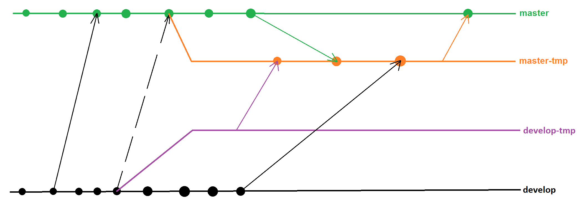

# Git

## Merge strategies

`git merge branch-name -s strategy` - perform merge with specified [strategy]((https://git-scm.com/docs/merge-strategies))

## Set commiter date to author date

`git filter-branch --env-filter 'export GIT_COMMITTER_DATE="$GIT_AUTHOR_DATE"'`

## Squash merge fix

